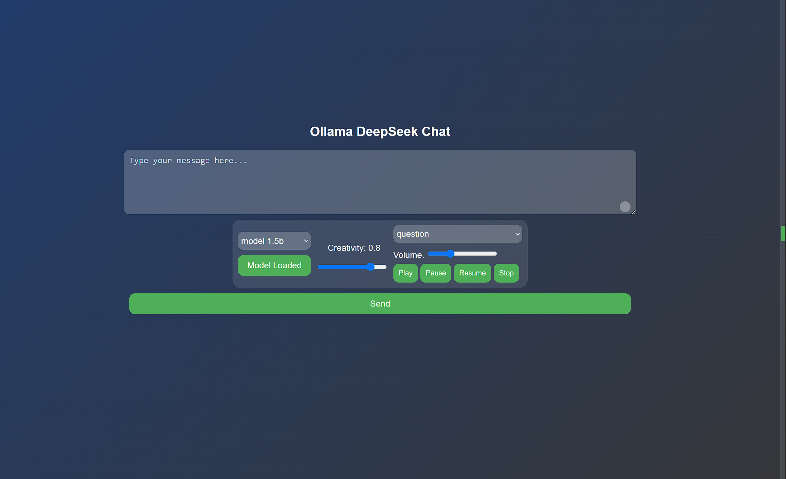

# Getting Started LLM DeepSeek Locally

Welcome to the project! Follow these simple steps to get started.

- There are two ways to start the project:
- WebStorm/VSCode server
- Python (version 3 or higher). 

## Steps

### 1. Download Ollama Server
Go to that page to download the Ollama server:
```bash

https://ollama.com/download/windows

```

### 2. Pull the Model
Download the smallest model (`deepseek-r1:1.5b`). You can also choose larger models like `8b` or `14b`, but note that they require more VRAM.
###### Download the smallest model (1.5B)
```bash
ollama pull deepseek-r1:1.5b
```

###### Download model (8B)
```bash
ollama pull deepseek-r1:8b
```

###### Download model (14B)
```bash
ollama pull deepseek-r1:14b
```


### 3. Copy repository with git
```bash
git clone https://github.com/Emil88PL/Local-LLM-DeepSeek.git
```
###### or download zip file
```bash
https://github.com/Emil88PL/Local-LLM-DeepSeek/archive/refs/heads/main.zip
```


### 4. Start the Server OR run directly 
Run the following command in the repository with file `index.html`:

```bash
# Using Python's built-in server (localhost:6969)
python3 -m http.server 6969

# Or use WebStor/VSCode for serving
Open repo with IDE and run the server
```
###### Alternatively, you can run directly:
```bash

ollama run deepseek-r1:1.5b
```

###### Alternatively, you can run directly:
```bash
ollama run deepseek-r1:8b
```

###### Alternatively, you can run directly:
```bash
ollama run deepseek-r1:14b
```


---

## Notes:
- [if you can't load module in UI - try first run in command line]
- The smallest model (`1.5b`) is recommended for users with limited VRAM.
- For larger models, ensure your hardware meets the requirements.


-
- Loaded model
- on the right Text to Speech - You can select what you want to hear (Questions, Answer, Thoughts)
- 
- [](https://ko-fi.com/N4N51E08N8)
- 